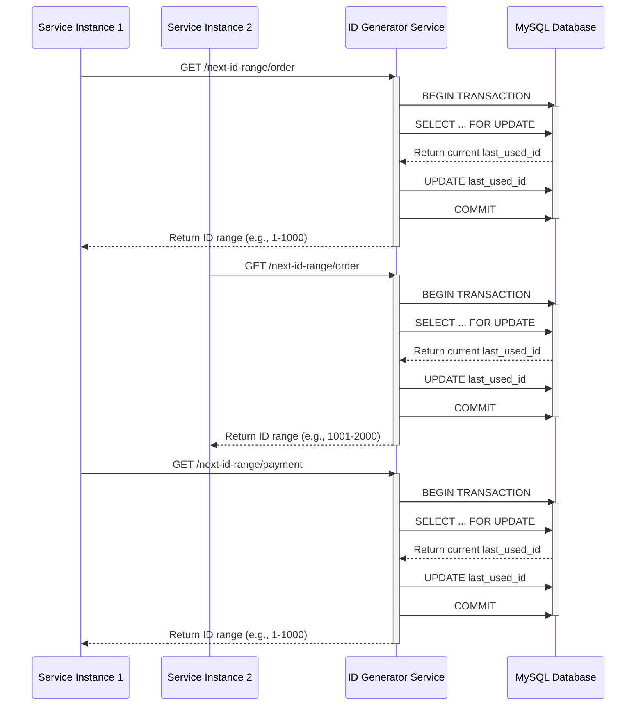
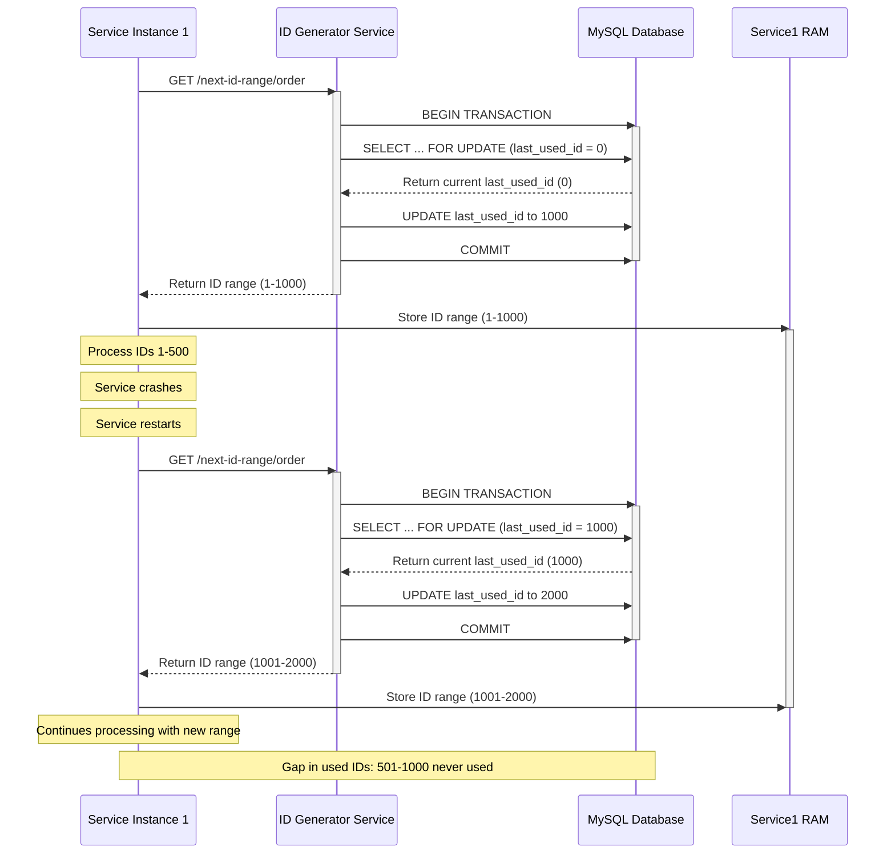

# Sequence diagram

```mermaid
sequenceDiagram
    participant Service1 as Service Instance 1
    participant Service2 as Service Instance 2
    participant IDGen as ID Generator Service
    participant DB as MySQL Database

    Service1->>IDGen: GET /next-id-range/order
    activate IDGen
    IDGen->>DB: BEGIN TRANSACTION
    activate DB
    IDGen->>DB: SELECT ... FOR UPDATE
    DB-->>IDGen: Return current last_used_id
    IDGen->>DB: UPDATE last_used_id
    IDGen->>DB: COMMIT
    deactivate DB
    IDGen-->>Service1: Return ID range (e.g., 1-1000)
    deactivate IDGen

    Service2->>IDGen: GET /next-id-range/order
    activate IDGen
    IDGen->>DB: BEGIN TRANSACTION
    activate DB
    IDGen->>DB: SELECT ... FOR UPDATE
    DB-->>IDGen: Return current last_used_id
    IDGen->>DB: UPDATE last_used_id
    IDGen->>DB: COMMIT
    deactivate DB
    IDGen-->>Service2: Return ID range (e.g., 1001-2000)
    deactivate IDGen

    Service1->>IDGen: GET /next-id-range/payment
    activate IDGen
    IDGen->>DB: BEGIN TRANSACTION
    activate DB
    IDGen->>DB: SELECT ... FOR UPDATE
    DB-->>IDGen: Return current last_used_id
    IDGen->>DB: UPDATE last_used_id
    IDGen->>DB: COMMIT
    deactivate DB
    IDGen-->>Service1: Return ID range (e.g., 1-1000)
    deactivate IDGen
```

# Edge case

```mermaid
sequenceDiagram
    participant Service1 as Service Instance 1
    participant IDGen as ID Generator Service
    participant DB as MySQL Database
    participant RAM as Service1 RAM

    Service1->>IDGen: GET /next-id-range/order
    activate IDGen
    IDGen->>DB: BEGIN TRANSACTION
    activate DB
    IDGen->>DB: SELECT ... FOR UPDATE (last_used_id = 0)
    DB-->>IDGen: Return current last_used_id (0)
    IDGen->>DB: UPDATE last_used_id to 1000
    IDGen->>DB: COMMIT
    deactivate DB
    IDGen-->>Service1: Return ID range (1-1000)
    deactivate IDGen

    Service1->>RAM: Store ID range (1-1000)
    activate RAM
    Note over Service1: Process IDs 1-500

    Note over Service1: Service crashes

    Note over Service1: Service restarts

    Service1->>IDGen: GET /next-id-range/order
    activate IDGen
    IDGen->>DB: BEGIN TRANSACTION
    activate DB
    IDGen->>DB: SELECT ... FOR UPDATE (last_used_id = 1000)
    DB-->>IDGen: Return current last_used_id (1000)
    IDGen->>DB: UPDATE last_used_id to 2000
    IDGen->>DB: COMMIT
    deactivate DB
    IDGen-->>Service1: Return ID range (1001-2000)
    deactivate IDGen

    Service1->>RAM: Store ID range (1001-2000)
    deactivate RAM
    Note over Service1: Continues processing with new range

    Note over Service1,DB: Gap in used IDs: 501-1000 never used
```